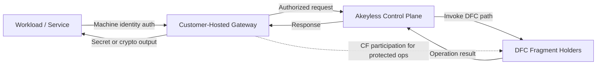

<GatewayConfigManagementNote />

Gateway Zero-Knowledge allows organizations to use Akeyless as a managed identity security platform while retaining customer-enforced cryptographic control for protected operations.

For regulated industries, this is best evaluated as a control-boundary model rather than a "SaaS versus on-premises" decision:

* Akeyless can authenticate and authorize requests, but it cannot unilaterally complete Customer Fragment (CF)-protected operations.
* CF-protected operations require customer-side fragment participation.
* Gateway is customer-hosted and customer-operated as the network bridge into private environments.

This model supports reviews for separation of duties, data sovereignty, and execution control.

## How It Works

Gateway Zero-Knowledge is based on [Distributed Fragments Cryptography (DFC)](https://docs.akeyless.io/docs/dfc-overview), where full private key material is not reconstructed on a single service component.

For architecture-level context, see [Zero-Knowledge Encryption SaaS Architecture](https://docs.akeyless.io/docs/zero-knowledge-architecture) and [DFC Deep Dive](https://docs.akeyless.io/docs/dfc-deep-dive).

### Trust and Control Model

* **Execution boundary:** DFC operations execute without reconstructing full private keys.
* **Control boundary:** CF-protected operations cannot complete without customer-side fragment participation.
* **Network boundary:** Gateway is customer-deployed and can be limited to private networks and approved routes.
* **Policy boundary:** RBAC and Gateway Allowed Access controls determine which identities can invoke operations.

### Service-to-Service Flow (Example)

1. A workload authenticates with a machine identity.
2. The workload sends a request through the customer-hosted Gateway.
3. Akeyless validates identity and policy, then invokes the relevant DFC operation path.
4. For CF-protected items, Gateway-side Customer Fragment participation is required.
5. The operation result is returned to the workload.



### Network Reachability Model

A Customer Fragment controls cryptographic eligibility, not network topology.

If a client can reach a Gateway, and that Gateway has the required Customer Fragment and policy permissions, that client can perform the allowed operation through that Gateway.

To reduce exposure across environments:

* Place each Gateway on the private network for the environment it serves.
* Limit which clients and services can reach each Gateway.
* Restrict allowed access IDs at the Gateway layer. For details, see [Restrict Gateway Access](https://docs.akeyless.io/docs/gateway-docker-advanced-configuration#restrict-gateway-access).
* Use different Gateways and Customer Fragments for separate trust boundaries.

### Caching Behavior in Zero-Knowledge Context

When Gateway caching is enabled, the Gateway can temporarily cache secret values in customer-controlled memory or Redis cache layers.

This does not change DFC control boundaries. For cache behavior details, see [Gateway Caching](https://docs.akeyless.io/docs/gateway-caching) and [Runtime Caching](https://docs.akeyless.io/docs/runtime-caching).

### Partition Behavior for CF-Protected Operations

The following matrix summarizes expected behavior for common availability scenarios.

| Scenario | Expected behavior |
| --- | --- |
| SaaS reachable, Customer Fragment available | CF-protected operations can complete when identity and policy checks pass. |
| SaaS reachable, Customer Fragment unavailable | CF-protected operations cannot complete. |
| SaaS unreachable, value present in cache | Cached read operations can still succeed according to runtime cache behavior. |
| SaaS unreachable, value not present in cache | Operation fails. |
| SaaS reachable, policy or allowed-access denies request | Operation is denied even when Customer Fragment is available. |

### Latency and Performance Expectations

Compared to non-CF flows, CF-protected operation paths can add processing and coordination overhead.

Observed latency impact depends on deployment topology, network distance, cache strategy, and request mix. For many repeated read patterns, runtime and proactive caching can reduce effective read latency.

For cache-driven latency controls, see [Gateway Caching](https://docs.akeyless.io/docs/gateway-caching) and [Runtime Caching](https://docs.akeyless.io/docs/runtime-caching).

## Decision Guide: CF and Non-CF

Use this table to select the operating model based on control requirements and operational overhead.

| Model | Use when | Operational tradeoffs |
| --- | --- | --- |
| Customer Fragment (CF) | Regulatory, contractual, or internal controls require customer-side participation for protected operations. | Strongest customer control boundary, plus additional setup and lifecycle management for fragment generation, secure backup, and deployment integration. |
| Non-CF | Workloads need standard zero-knowledge architecture without customer-fragment enforcement requirements. | Simpler operations and rollout, but no customer-fragment participation gate for operation completion. |

## Prerequisites

Before implementing Gateway Zero-Knowledge, confirm the following:

* A Gateway deployment is running and reachable from the required workloads. For deployment options, see [Gateway Overview](https://docs.akeyless.io/docs/gateway-overview).
* A Gateway authentication method and access policy are configured. For access configuration details, see [Gateway Authentication and Access](https://docs.akeyless.io/docs/gateway-authentication-and-access).
* The identity used for key creation and Gateway operations has the required permissions for DFC key management and Gateway access.
* A secure backup process is defined for Customer Fragment files and values.
* Required network routes to Gateway and Akeyless SaaS services are available. For connectivity requirements, see [Gateway Network Connectivity](https://docs.akeyless.io/docs/gateway-network-connectivity).

## Implementation

Use the following sequence to implement Gateway Zero-Knowledge across interfaces and infrastructures.

### Step 1: Generate a Customer Fragment (CLI)

```shell
akeyless gen-customer-fragment --name <CF-Name> --description MyFirstCF --json
```

For command parameters and additional examples, see [CLI Reference: gen-customer-fragment](https://docs.akeyless.io/docs/cli-reference-encryption-keys#gen-customer-fragment).

Example output:

```json
{
  "customer_fragments": [
    {
      "id": "cf-xyzxyzxyzxyzxyzxyz",
      "value": "SomE/CUstOmer/FrAGMenTvALue==",
      "description": "MyFirstCF",
      "name": "<CF-Name>"
    }
  ]
}
```

Save the output as `customer_fragments.json`.

Customer Fragments are generated through CLI workflows (or the HSM integration flow), then referenced by Gateway and key-creation workflows. Gateway Console key-creation flows select existing Customer Fragments.

> ⚠️ **Warning:**
>
> Back up Customer Fragments securely. Encryption keys created with a Customer Fragment cannot be reconstructed without it.

### Step 2: Attach the Customer Fragment to the Gateway

Use these deployment-specific implementation anchors for direct navigation:

* Docker: [Authentication](https://docs.akeyless.io/docs/gateway-docker-advanced-configuration#authentication), [API Key Authentication](https://docs.akeyless.io/docs/gateway-docker-advanced-configuration#api-key-authentication), [Certificates Authentication](https://docs.akeyless.io/docs/gateway-docker-advanced-configuration#certificates-authentication)
* Helm: [Authentication](https://docs.akeyless.io/docs/gateway-deploy-kubernetes-helm#authentication), [API Key Authentication](https://docs.akeyless.io/docs/gateway-deploy-kubernetes-helm#api-key-authentication), [Certificates](https://docs.akeyless.io/docs/gateway-deploy-kubernetes-helm#certificates)
* Serverless AWS: [Authentication](https://docs.akeyless.io/docs/gateway-deploy-serverless-aws#authentication), [Customer Fragment](https://docs.akeyless.io/docs/gateway-deploy-serverless-aws#customer-fragment)
* Serverless Azure: [Authentication](https://docs.akeyless.io/docs/gateway-deploy-serverless-azure#authentication), [Customer Fragment](https://docs.akeyless.io/docs/gateway-deploy-serverless-azure#customer-fragment)
* Docker Compose: [Authentication](https://docs.akeyless.io/docs/gateway-deploy-docker-compose#authentication), [API Key Authentication](https://docs.akeyless.io/docs/gateway-deploy-docker-compose#api-key-authentication), [Certificates Authentication](https://docs.akeyless.io/docs/gateway-deploy-docker-compose#certificates-authentication)

#### Standalone Docker

Mount `customer_fragments.json` into `/home/akeyless/.akeyless/customer_fragments.json`:

```shell
docker run -d -p 8000:8000 -p 5696:5696 \
  -v /path/to/customer_fragments.json:/home/akeyless/.akeyless/customer_fragments.json \
  -e GATEWAY_ACCESS_ID="identity-access-id" \
  -e GATEWAY_ACCESS_KEY="identity-access-key" \
  --name akeyless-gw akeyless/base:latest-akeyless
```

For compatibility with older deployments, legacy variables such as `ADMIN_ACCESS_ID` and `ADMIN_ACCESS_KEY` can still appear.

#### Kubernetes with Helm

Create a Kubernetes Secret that contains the `customer-fragments` key:

```shell
kubectl create secret generic gateway-customer-fragments \
  --from-file=customer-fragments=./customer_fragments.json
```

Reference that secret in Helm values:

```yaml values.yaml
globalConfig:
  customerFragmentsExistingSecret: gateway-customer-fragments
```

For full platform setup flows, see [Kubernetes with Helm Deployment](https://docs.akeyless.io/docs/gateway-deploy-kubernetes-helm).

#### Other Infrastructures

* [Docker Compose Deployment](https://docs.akeyless.io/docs/gateway-deploy-docker-compose)
* [Serverless AWS Deployment](https://docs.akeyless.io/docs/gateway-deploy-serverless-aws)
* [Serverless Azure Deployment](https://docs.akeyless.io/docs/gateway-deploy-serverless-azure)
* [Azure Container App Deployment](https://docs.akeyless.io/docs/gateway-deploy-azure-container-app)

### Step 3: Create a DFC Key Bound to the Customer Fragment

> ⚠️ **Warning:**
>
> To create a DFC key with Customer Fragment, the identity in use must be allowed in the Gateway access policy.

### Create DFC Key from the Akeyless Console

1. Open the Gateway Console at `https://<gateway-url>:8000/console`.
2. Go to **Items**.
3. Select **New**, then **Encryption Key**, then **DFC**.
4. Specify key parameters, then select the Customer Fragment.
5. Select **Save**.

### Create Zero Knowledge Key from the Akeyless CLI

```shell
akeyless create-dfc-key --name MyKeyWithMyCF --alg AES256GCM -f <customer-fragment-id>
```

Where:

* `name`: DFC key name.
* `alg`: DFC key algorithm.
* `customer-frg-id`: Customer Fragment ID used for the DFC key.

For command parameters and additional examples, see [CLI Reference: create-dfc-key](https://docs.akeyless.io/docs/cli-reference-encryption-keys#create-dfc-key).

Example output:

```text
A new AES256GCM key named MyKeyWithMyCF was successfully created
```

### Step 4 (Optional): Set a Default Encryption Key in Gateway

Set a default encryption key in Gateway configuration when all newly created items in this Gateway context should use a specific key by default.

> ℹ️ **Note:**
>
> Only symmetric keys with `AESGCM` algorithm can be set as default encryption keys.

1. Go to **Gateways**, then the relevant Gateway, then **Manage Gateway**.
2. Go to **Defaults**.
3. Select a key in **Default Encryption Key**.
4. Select **Save Changes**.

## Machine Identity Authentication Mapping

This section lists the supported machine-identity authentication methods for Gateway Zero-Knowledge service-to-service flows.

Use this mapping to select a supported method and jump to the corresponding implementation guidance:

| Method | Typical workload context | Implementation reference |
| --- | --- | --- |
| API key | Workloads that can securely store and rotate access keys | [Authenticate with API key](https://docs.akeyless.io/docs/auth-with-api-key) |
| Cloud IAM (AWS, Azure, GCP) | Cloud-native services using platform identity | [Authenticate with AWS](https://docs.akeyless.io/docs/auth-with-aws), [Authenticate with Azure](https://docs.akeyless.io/docs/auth-with-azure), [Authenticate with GCP](https://docs.akeyless.io/docs/auth-with-gcp) |
| Kubernetes service account | In-cluster workloads using Kubernetes-native identity | [Authenticate with Kubernetes](https://docs.akeyless.io/docs/auth-with-kubernetes) |
| Certificate-based authentication | Workloads using client certificate trust chains | [Authenticate with certificate](https://docs.akeyless.io/docs/auth-with-certificate) |
| Universal Identity | Workloads requiring token-based machine identity across environments | [Authenticate with Universal Identity](https://docs.akeyless.io/docs/auth-with-universal-identity) |

For Gateway-specific access delegation controls, see [Gateway Authentication and Access](https://docs.akeyless.io/docs/gateway-authentication-and-access).

## Troubleshooting

### 1. Missing Customer Fragment Mount or Secret Key Name

Symptoms include missing fragment errors during CF-protected operations or deployment startup warnings.

Checks:

* Docker: confirm `customer_fragments.json` is mounted to `/home/akeyless/.akeyless/customer_fragments.json`.
* Helm: confirm the referenced secret exists and includes key name `customer-fragments`.
* Serverless: confirm `customer_fragments` payload is valid JSON and mapped to the deployment parameter.

### 2. Insufficient Gateway Allowed Access

Symptoms include denied Gateway management actions or inability to complete required operations.

Checks:

* Confirm the active identity is included in Gateway Allowed Access policy.
* Confirm required Gateway permissions are assigned for the intended operation scope.
* Confirm RBAC policy path permissions also allow the same operation.

### 3. Authentication Method Mismatch

Symptoms include authentication failures at Gateway startup or request-time authorization errors.

Checks:

* Confirm auth method type matches deployment configuration (for example `access_key`, cloud IAM, certificate, or universal identity).
* Confirm required credentials, secrets, or certificates are present and mapped to expected configuration keys.
* For legacy deployments, confirm variable naming consistency when mixing `GATEWAY_*` and `ADMIN_*` conventions.

## Compliance Reference Bundle

For architecture and compliance review packets, use these canonical pages:

* [Zero-Knowledge Encryption SaaS Architecture](https://docs.akeyless.io/docs/zero-knowledge-architecture)
* [Platform Components Overview](https://docs.akeyless.io/docs/components)
* [Gateway Overview](https://docs.akeyless.io/docs/gateway-overview)
* [Gateway Network Connectivity](https://docs.akeyless.io/docs/gateway-network-connectivity)
* [Akeyless Gateway Best Practices](https://docs.akeyless.io/docs/gateway-best-practices)
