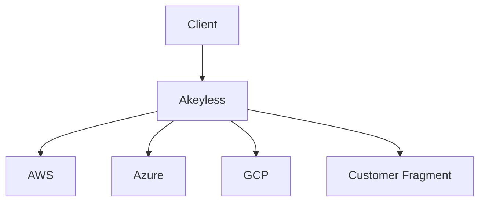

Distributed Fragments Cryptography (DFC) is the cryptographic framework that enables Akeyless to perform secret, key, and certificate operations without ever storing or reconstructing complete private key material. Instead of placing full keys in a vault or database, DFC divides key material into multiple fragments and performs cryptographic operations directly across those fragments.

DFC supports the Vaultless architecture by ensuring that no complete encryption key exists on any server, at any point.

## Core Concepts

DFC splits an encryption key into multiple mathematical fragments. These fragments:

* Are created independently across isolated environments.
* Never combine into a full key, including during key generation or use.
* Can optionally include a Customer Fragment, held exclusively by the customer.
* Are processed independently using standard, NIST-approved cryptographic primitives.

The complete key is never assembled. Instead, cryptographic operations are completed by combining mathematical derivations from each fragment, resulting in a short-lived, derived key used only for a single operation.

## How Operations Work

At a high level:

1. A client requests an operation such as encryption, decryption, signing, or key-based secret generation.
2. Each fragment holder computes a partial derivation using its fragment.
3. These derivations are combined into a one-time-use derived key on the client side (or on the customer's Akeyless Gateway when using a Customer Fragment).
4. The derived key is used for the requested operation and then discarded.

At no point is the original key constructed or exposed.

## Customer Fragment

Organizations may hold one of the key fragments in their own environment. When used:

* The platform cannot perform operations unless the Customer Fragment participates.
* The customer maintains exclusive control over key usage.
* No entity, including Akeyless, can derive or reconstruct the key without the Customer Fragment.

This enforces separation of duties and supports regulated environments requiring customer-held key material.

## DFC Diagram

## Summary

DFC provides the foundation for Akeyless’s Vaultless architecture by ensuring that complete key material never exists on any server. By performing cryptographic operations directly on independent fragments, including optionally a Customer Fragment, Akeyless enforces strict separation of duties, reduces exposure, and removes the need for sensitive data storage.
