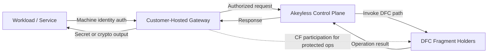

Akeyless uses a Zero-Knowledge Encryption architecture to perform secret, key, and certificate operations without storing sensitive material in a retrievable form. Instead of relying on a storage backend, operations are executed through distributed cryptographic workflows that never reconstruct full private key material. This eliminates the risks associated with stored secrets and removes the need to maintain vault servers or encrypted databases.

The architecture ensures that no complete secret or private key is ever present at rest within the platform.

## Architecture Overview

Traditional vault systems maintain encrypted storage that contains secrets or private keys. Akeyless replaces this model with an execution-based approach built on Distributed Fragments Cryptography (DFC). In this model:

* Sensitive key material is represented as independent fragments.
* Fragments remain confined to their respective locations.
* Cryptographic operations use fragment-derived values rather than reconstructing a full key.

The result is an architecture where cryptographic operations occur without persisting or retrieving complete secrets or private keys.

### Core architectural characteristics

* No storage of full secrets, private keys, or reconstructible credential material.
* No database to replicate, synchronize, or back up.
* Fragment values remain isolated in their assigned locations.
* Optional customer-held fragment enforces separation of control.

All identity operations—such as signing, encryption, decryption, or generating short-lived credentials—are completed without assembling full private key material at any stage of the workflow.

***

## Cryptographic Workflow

When a client requests an operation (For example, retrieving a secret, generating a dynamic credential, or performing a signing operation):

1. The Akeyless control plane authenticates and authorizes the request.
2. The platform triggers a distributed cryptographic workflow based on the key or secret type.
3. Each participating fragment holder processes its own fragment and returns a derived value.
4. Derived values are combined to produce an operation-specific result without exposing complete key material.
5. No reconstructed secret or private key is written to disk or retained after the operation.

If a Customer Fragment (CF) is configured, Akeyless cannot complete cryptographic operations without the customer's involvement.

***

## Control-Boundary Model

For regulated and high-control environments, Zero-Knowledge is best evaluated as a control-boundary model rather than a "SaaS versus on-premises" decision.

Key boundaries:

* **Execution boundary**: DFC operations execute without reconstructing full private keys.
* **Control boundary**: CF-protected operations cannot complete without customer-side fragment participation.
* **Network boundary**: Gateway is customer-deployed and can be restricted to private networks and approved routes.
* **Policy boundary**: RBAC and Gateway Allowed Access controls determine which identities can invoke operations.

This boundary model supports separation-of-duties, sovereignty, and operational control reviews.

### Service-to-Service Flow (Conceptual)

1. A workload authenticates with a machine identity.
2. The workload sends the request through a customer-hosted Gateway.
3. Akeyless validates identity and policy, then invokes the relevant DFC operation path.
4. For CF-protected items, customer-side fragment participation is required.
5. The operation result is returned to the workload.

### Network Reachability Model

A Customer Fragment controls cryptographic eligibility, not network topology.

If a client can reach a Gateway, and that Gateway has the required Customer Fragment and policy permissions, that client can perform the allowed operation through that Gateway.

Common segmentation patterns:

* Place each Gateway on the private network for the environment it serves.
* Limit which clients and services can reach each Gateway.
* Restrict allowed access IDs at the Gateway layer.
* Use different Gateways and Customer Fragments for separate trust boundaries.

***

## Comparison to Storage-Based Vault Systems

Traditional vaults:

* Store secrets and keys in encrypted form.
* Require a persistent storage backend, backup strategy, and replication.
* Often decrypt or reassemble keys during operations.
* Are vulnerable if the storage or master key is compromised.

Under the Zero-Knowledge Encryption model:

* Secrets and keys are **not stored** and cannot be retrieved.
* Key material is **never reconstructed** during operation execution.
* No storage lifecycle tasks (backups, snapshots, migrations) are required.
* Retrieval attacks are not possible because no recoverable material exists.

This changes the threat model: compromising the storage layer yields no useful data because none is kept there.

***

## Gateway Role

The Akeyless Gateway provides access to private networks, closed environments, and on-premises infrastructure. Its role is limited to communication and optional customer-fragment participation. The Gateway:

* Does not store secrets or cryptographic fragments.
* Can cache secret values and metadata in customer-controlled cache layers when caching is enabled, but never stores full private keys or cryptographic fragments.
* Remains stateless with respect to sensitive data.
* Can be deployed in restricted, air-gapped, or isolated environments.

The Gateway does not alter the Zero-Knowledge Encryption architecture; it only extends access to networks not reachable by the SaaS control plane.

For implementation steps that use Customer Fragments with Gateway deployments, see [Gateway Zero-Knowledge](https://docs.akeyless.io/docs/gateway-zero-knowledge).

***

## Availability and Performance Behavior

### Partition Behavior for CF-Protected Operations

The following matrix summarizes expected behavior for common availability scenarios.

| Scenario | Expected behavior |
| --- | --- |
| SaaS reachable, Customer Fragment available | CF-protected operations can complete when identity and policy checks pass. |
| SaaS reachable, Customer Fragment unavailable | CF-protected operations cannot complete. |
| SaaS unreachable, value present in cache | Cached read operations can still succeed according to runtime cache behavior. |
| SaaS unreachable, value not present in cache | Operation fails. |
| SaaS reachable, policy or allowed-access denies request | Operation is denied even when Customer Fragment is available. |

### Latency Expectations

Compared to non-CF flows, CF-protected operation paths can add processing and coordination overhead.

Observed latency depends on deployment topology, network distance, cache strategy, and request mix. For repeated read patterns, runtime and proactive caching can reduce effective read latency.

***

## Decision Guide: CF and Non-CF

Use this table to select an operating model based on control requirements and operational overhead.

| Model | Use when | Operational tradeoffs |
| --- | --- | --- |
| Customer Fragment (CF) | Regulatory, contractual, or internal controls require customer-side participation for protected operations. | Strongest customer control boundary, plus additional setup and lifecycle management for fragment generation, secure backup, and deployment integration. |
| Non-CF | Workloads need zero-knowledge architecture without customer-fragment enforcement requirements. | Simpler operations and rollout, but no customer-fragment participation gate for operation completion. |

***

## Operational Considerations

Removing the storage layer eliminates several operational concerns:

* No vault servers to deploy, patch, or maintain.
* No backups or replication mechanisms for stored secrets.
* No need for database migration or recovery processes.
* Reduced exposure to storage compromise, disk forensics, or exfiltration attacks.

Capacity planning focuses on request throughput rather than storage performance.

***

## Security Properties

Key security properties of the Zero-Knowledge Encryption architecture include:

* **Non-reconstruction** — Full private keys never exist in memory on any single component.
* **Non-persistence** — Sensitive material is never written to disk.
* **Fragment isolation** — Fragment values exist only within their respective fragment holders.
* **Optional customer control** — A customer-held fragment prevents unilateral operation execution.
* **Compartmentalization** — Compromise of any single component yields no usable key information.

These properties reduce the exposure surface associated with stored-secret systems.

***

## Summary

The Akeyless Zero-Knowledge Encryption architecture removes the need for a secrets or key storage backend by executing operations entirely through distributed cryptographic fragments. No secret or private key is stored or reconstructed at any time. This model provides a predictable, storage-free approach to managing secrets, keys, and certificates across distributed environments.
