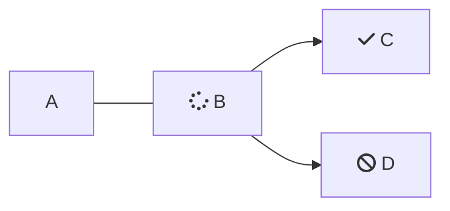

# Heading 1

## Heading 2

### Heading 3

#### Heading 4

##### Heading 5

###### Heading 6

Basic text. **Bolded text.** _Italicized text._ `Inline code.`<Anchor label="Link." target="_blank" href="https://www.example.com">Link.</Anchor> ~~Strikethrough.~~

Image (with border): 

> Blockquote line 1.
>
> Blockquote line 2.

Unordered List, Prior Text:

* Unordered List Item 1
  * Level 2
    * Level 3
      * Level 4
        * Level 5
* Unordered List Item 2
* Unordered List Item 3

Ordered List, Prior Text:

1. Ordered List Item 1
   1. Level 2
      1. Level 3
         1. Level 4
            1. Level 5
2. Ordered List Item 2
3. Ordered List Item 3

Horizontal line: "***" or "---"

***

Table:

| Header | Header |
| ------ | ------ |
| Text   | Text   |
| Text   | Text   |

Fenced Code Block:

```json
{
  "firstName": "John",
  "lastName": "Smith",
  "age": 25
}
```
```
Sample text.
```

<br />

Here's a sentence with a footnote. [^1]

Task List or Check List:

* [x] Task 1
* [ ] Task 2
* [ ] Task 3

Accordion:

<Accordion title="My Accordion Title" icon="fa-info-circle">
  Lorem ipsum dolor sit amet, **consectetur adipiscing elit.** Ut enim
  ad minim veniam, quis nostrud exercitation ullamco. Excepteur sint
  occaecat cupidatat non proident!
</Accordion>

Cards:

<Cards columns={4}>
  <Card title="First Card" href="https://readme.com" icon="fa-home" target="_blank">
    Neque porro quisquam est qui dolorem ipsum quia
  </Card>

  <Card title="Second Card" icon="fa-user">
    *Lorem ipsum dolor sit amet, consectetur adipiscing elit*
  </Card>

  <Card title="Third Card" icon="fa-star">
    > Ut enim ad minim veniam, quis nostrud ullamco
  </Card>

  <Card title="Fourth Card" icon="fa-question">
    **Excepteur sint occaecat cupidatat non proident**
  </Card>
</Cards>

Columns:

<Columns layout="auto">
  <Column>
    Neque porro quisquam est qui dolorem ipsum quia
  </Column>

  <Column>
    *Lorem ipsum dolor sit amet, consectetur adipiscing elit*
  </Column>

  <Column>
    > Ut enim ad minim veniam, quis nostrud ullamco
  </Column>
</Columns>

Tabs:

<Tabs>
  <Tab title="First Tab">
    Welcome to the content that you can only see inside the first Tab.
  </Tab>

  <Tab title="Second Tab">
    Here's content that's only inside the second Tab.
  </Tab>

  <Tab title="Third Tab">
    Here's content that's only inside the third Tab.
  </Tab>
</Tabs>

Callout:

<Callout icon="📘" theme="info">

</Callout>

Recipe:

<Recipe slug="python-aws_iam" title="Python  - AWS_IAM" />

Mermaid Diagram:



YouTube Embed:

<Embed typeOfEmbed="youtube" url="https://www.youtube.com/watch?v=_IvzfGJWY_0" html="%3Ciframe%20class%3D%22embedly-embed%22%20src%3D%22%2F%2Fcdn.embedly.com%2Fwidgets%2Fmedia.html%3Fsrc%3Dhttps%253A%252F%252Fwww.youtube.com%252Fembed%252F_IvzfGJWY_0%253Ffeature%253Doembed%26display_name%3DYouTube%26url%3Dhttps%253A%252F%252Fwww.youtube.com%252Fwatch%253Fv%253D_IvzfGJWY_0%26image%3Dhttps%253A%252F%252Fi.ytimg.com%252Fvi%252F_IvzfGJWY_0%252Fhqdefault.jpg%26type%3Dtext%252Fhtml%26schema%3Dyoutube%22%20width%3D%22854%22%20height%3D%22480%22%20scrolling%3D%22no%22%20title%3D%22YouTube%20embed%22%20frameborder%3D%220%22%20allow%3D%22autoplay%3B%20fullscreen%3B%20encrypted-media%3B%20picture-in-picture%3B%22%20allowfullscreen%3D%22true%22%3E%3C%2Fiframe%3E" href="https://www.youtube.com/watch?v=_IvzfGJWY_0" providerUrl="https://www.youtube.com/" providerName="YouTube" />

[^1]: This is the footnote.
