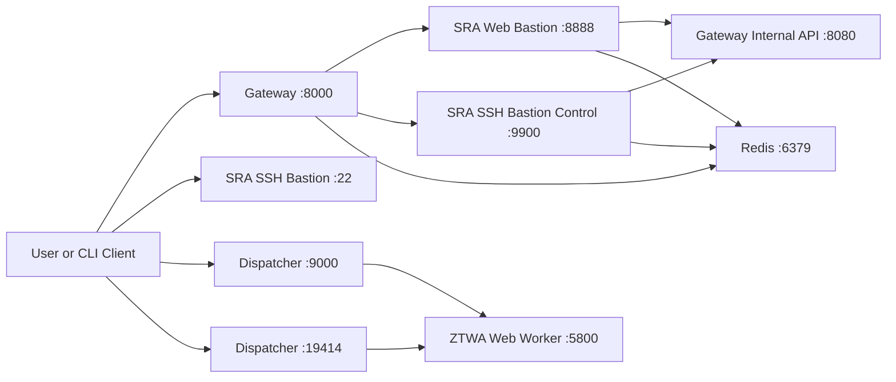

Use this page to verify runtime component boundaries, required network paths, and control-plane wiring for Secure Remote Access (SRA).

## Port Inventory

For the canonical baseline inventory, also see [SRA Requirements](https://docs.akeyless.io/docs/sra-requirements#port-inventory).

| Component | Port(s) | Purpose | Exposure |
| --- | --- | --- | --- |
| Gateway | `8000` | External API and SRA portal and web paths | User-facing |
| Gateway | `8080` | Internal API and health endpoint | Internal |
| Gateway | `8889` | Metrics endpoint when metrics are enabled | Internal/monitoring |
| SRA SSH bastion | `22` (Kubernetes), `2222` (Docker host mapping) | SSH data-plane sessions | User-facing |
| SRA SSH bastion | `9900` | SSH bastion control-plane API | Internal |
| SRA web bastion | `8888` | Web bastion service endpoint | Internal |
| ZTWA dispatcher | `9000` | Main web-session entrypoint | User-facing |
| ZTWA dispatcher | `19414` | Web proxy mode entrypoint | User-facing |
| ZTWA web-worker | `5800` | Worker service endpoint used by dispatcher | Internal |
| Redis/cache | `6379` | Session and cache backend | Internal |

## Component Dependency Graph

The following flow summarizes the most common runtime dependency direction.



## Internal Service Wiring

In containerized deployments, the following runtime variables commonly define service discovery:

* `REMOTE_ACCESS_WEB_SERVICE_INTERNAL_URL` for gateway to web bastion control path (for example `http://akeyless-sra-web:8888`).
* `REMOTE_ACCESS_SSH_SERVICE_INTERNAL_URL` for gateway to SSH bastion control path (for example `http://akeyless-sra-ssh:9900`).
* `INTERNAL_GATEWAY_API` for bastion components to gateway health/internal API (`8080`).
* `REDIS_ADDR` for cache and session backend (`6379`).

## Deployment Boundary Patterns

Use one of these topologies based on security and scale requirements:

1. Same cluster, single namespace: fastest to deploy and troubleshoot.
2. Same cluster, dedicated namespace for SRA components: improves policy isolation while keeping low latency.
3. Separate clusters for gateway and SRA bastions/dispatcher: useful for large organizations and blast-radius reduction; requires explicit networking and DNS reachability between clusters.

For Kubernetes deployments, expose the SSH bastion service according to [SRA setup on Kubernetes](https://docs.akeyless.io/docs/sra-setup-k8s) and keep internal control-plane ports non-public whenever possible.

## Namespace Isolation Guidance

For Kubernetes production deployments:

* Deploy SRA-related workloads into a dedicated namespace per environment.
* Apply namespace-scoped network policies so only required east-west paths are allowed.
* Keep Redis and control-plane endpoints (`8080`, `8888`, `9900`, `5800`) cluster-internal.
* Restrict user-facing exposure to only the required entrypoints (`8000`, `22`, `9000`, `19414`) based on enabled features.

### Implementation Pattern

Use this sequence to implement the isolation recommendations.

1. Create dedicated namespaces per environment (for example `sra-prod`, `sra-staging`).
2. Place Gateway and SRA runtime components in that namespace (or paired namespaces with explicit policies).
3. Apply default-deny ingress and egress policies first.
4. Add explicit allow rules only for required SRA runtime paths.
5. Expose only approved external services with `LoadBalancer` or ingress.
6. Validate effective policy behavior before production transition.

### Baseline Controls to Apply

1. Namespace labels for policy selection and operations ownership.
2. Resource quotas and limit ranges to avoid noisy-neighbor impact.
3. Service account and RBAC scoping per component class (Gateway, bastion, dispatcher, worker).
4. Network policies for:

* Gateway to bastion control-plane ports (`8888`, `9900`).
* Bastion components to Gateway internal API (`8080`).
* Runtime components to Redis (`6379`).
* Dispatcher to web-worker (`5800`).

### Example Validation Workflow

After applying namespace and policy controls, validate:

```shell
# Confirm workloads are in the expected namespace
kubectl get pods -n <sra-namespace>

# Verify only intended services are externally exposed
kubectl get svc -n <sra-namespace>

# Review applied network policies
kubectl get networkpolicy -n <sra-namespace>

# Validate gateway and component readiness
kubectl get endpoints -n <sra-namespace>
```

Then run a functional smoke test from the user perspective:

1. Portal/API access through Gateway (`8000`).
2. SSH session launch (`22`) when SSH access is enabled.
3. Web session launch through dispatcher (`9000` or `19414`) when ZTWA is enabled.

If any flow fails, inspect policy denies and service endpoint reachability before widening exposure.
