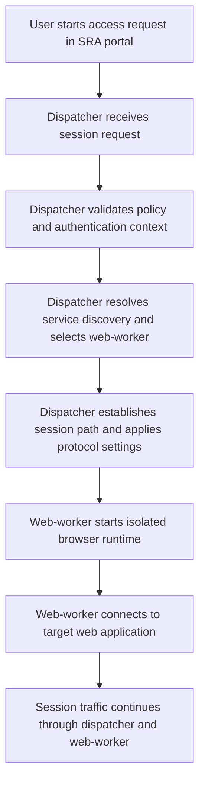

This page describes the Zero Trust Web Access (ZTWA) runtime topology and the key deployment settings for Kubernetes and Docker Compose.

## Architecture and Traffic Flow

ZTWA uses two primary services:

* **Dispatcher**: Entry point that authenticates requests and dispatches session traffic
* **Web-worker**: Isolated browser runtime that serves user sessions

### Component Responsibilities

Dispatcher responsibilities:

* Handles the user-side session connection from the portal flow
* Applies access policy decisions before a worker session is established
* Selects and routes traffic to an available web-worker instance
* Enforces deployment-specific protocol behavior (for example, HTTP mode or SOCKS mode)

Web-worker responsibilities:

* Launches and maintains the isolated browser runtime for the approved session
* Establishes outbound connectivity from the worker runtime to the target application
* Keeps user browsing activity isolated from other sessions

Traffic flow:

1. User requests access from the SRA portal.
2. Dispatcher receives the session request and validates policy and authentication context.
3. Dispatcher resolves worker service discovery information and selects an available web-worker.
4. Dispatcher establishes a session path to the selected worker and applies protocol-specific settings.
5. In isolated-browser mode, the web-worker starts the isolated browser runtime and connects to the target web application.
6. In isolated-browser mode, user traffic flows through dispatcher and worker for the lifetime of the approved session.

## Required Topology Settings

### Service Discovery

Set worker discovery so dispatcher can route traffic to workers.

* Docker Compose: set `SERVICE_DNS` for worker discovery (for example, `SERVICE_DNS=worker`) and configure dispatcher service DNS values in your deployment settings.
* Kubernetes (Helm chart): DNS values are generated by the chart and injected into containers through `WEB_WORKER_SERVICE_DNS` (dispatcher) and `WEB_DISPATCHER_SERVICE_DNS` (web-worker).

### Proxy Mode and Ports

* Proxy mode is controlled by `WEB_PROXY_TYPE` (`http` or default SOCKS mode).
* Port `19414` is used for proxy-mode traffic.

For SOCKS5 protocol details, see [RFC 1928](https://www.rfc-editor.org/rfc/rfc1928).

### HTTP Deployments

For HTTP deployments, set `DISABLE_SECURE_COOKIE=true` in dispatcher/bastion environment configuration.

For browser cookie security behavior, see [MDN Set-Cookie: Secure](https://developer.mozilla.org/en-US/docs/Web/HTTP/Headers/Set-Cookie#secure).

### Privileged Access Pattern

Configure:

* `PRIVILEGED_ACCESS_ID` as the privileged machine identity used by the bastion
* `ALLOWED_ACCESS_IDS` as the requester IDs allowed to request access

This pattern allows users to keep list-level permissions while the bastion fetches target credentials on their behalf after authorization.

## Platform Variable Mapping

| Behavior | Docker Compose | Kubernetes (Helm) |
| --- | --- | --- |
| Worker discovery | `SERVICE_DNS` (for example, `SERVICE_DNS=worker`) and dispatcher service DNS settings | chart-generated `WEB_WORKER_SERVICE_DNS` and `WEB_DISPATCHER_SERVICE_DNS` |
| Proxy protocol mode | `WEB_PROXY_TYPE` | set through `dispatcher.env` |
| HTTP cookie behavior | `DISABLE_SECURE_COOKIE` | `dispatcher.config.disableSecureCookie` |
| Privileged Access ID | `PRIVILEGED_ACCESS_ID` | `dispatcher.config.privilegedAccess.accessID` |
| Allowed requester IDs | `ALLOWED_ACCESS_IDS` | `dispatcher.config.privilegedAccess.allowedAccessIDs` |

## Platform Guides

* Kubernetes deployment and values: [Zero Trust Web Access on K8s](https://docs.akeyless.io/docs/sra-web-access-on-k8s)
* Docker Compose deployment and env values: [Zero Trust Web Access on Docker](https://docs.akeyless.io/docs/sra-web-access-docker)
* Extended browser policies, DLP, private CA certificate handling, and advanced options: [Zero Trust Web Access Advanced Configuration](https://docs.akeyless.io/docs/sra-web-access-on-k8s-adv-config)
